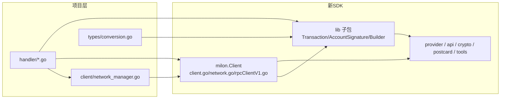

## 需求概述

将 `d:\pprojiect\milon-api-server` 项目中的 SDK 从当前 `gosdk-develop/`（旧版，含 6 个本地修改文件）整体替换为 `C:\Users\xiaoqi\Downloads\gosdk-develop (2)\gosdk-develop`（新版官方 SDK）。

## 核心约束

- **彻底放弃本地补丁**：6 个被本地修改过的 SDK 文件（provider.go 的 any_signer 支持、rpcClientV1.go 的 any_signer 集成与调试打印、crypto/address.go 的 NewAddressFromAny、api/base.go 的 ErrUnknownResourceTypeTag 容错、idlTypeResolver.go 的哨兵错误、accountSignature.go 的调试打印）**一律不移植**，直接采用新 SDK 官方行为。
- **HTTP API 接口完全不变**：迁移后所有对外端点的请求/响应结构保持原样（尤其 `/api/write`、`/api/transactions/submit` 的 `txHash` 字段、`/api/simulate` 的 receipt 结构）。
- 交易构建采用**保守方法链**（`lib.NewTransactionWithParam` + Transaction 签名方法），与现有代码结构最接近、改动最小；新 `lib.TransactionBuilder`（ApplySlots/SignWith）作为可选优化，默认不采用。
- 迁移后必须通过编译验证与运行时端到端验证。

## 核心功能范围

1. SDK 目录整体替换（go.mod 的 `replace` 指令不变）。
2. 项目代码对新 SDK API 的完整适配：类型迁移（`milon.X` → `lib.X`）、客户端构造、方法签名变化。
3. 被删除高层 API（`BuildAndSubmit*`、`BuildAndSimulate*`）的等价重写。
4. 行为差异评估与文档说明（LocalNet ChainId 变化、IDL 容错移除、any_signer 能力移除、新增 randomness IDL）。

## 技术栈

- 项目：Go 1.25.9 + Gin（不变）
- SDK：`github.com/milon-labs/milon-go-sdk`，通过 `go.mod` 中 `replace github.com/milon-labs/milon-go-sdk => ./gosdk-develop` 指向本地目录（不变）

## 实施策略

整体采用「目录替换 → 机械适配 → 逻辑重写 → 构建修复 → 运行时验证」五阶段策略。新 SDK 是破坏性重构（根包瘦身为 `client.go`/`network.go`/`rpcClientV1.go`，交易/签名逻辑迁入新子包 `milon/lib`），因此核心工作是把项目对根包类型的依赖迁移到 `lib`，并把被删除的高层 API 用「`lib.NewTransactionWithParam` + Transaction 签名方法 + `Client.SimulateTx/SubmitTx`」等价重建。

## 关键技术决策

### 1. 客户端构造（client/network_manager.go）

- `milon.NetworkConfig` → `milon.Network`；`LocalNetConfig`/`DevNetConfig` → `LocalNet`/`DevNet`（字段名相同，仅类型与变量名变化）
- `milon.MolinClient` → `milon.Client`；`NewMolinClientWithErr(cfg)` → `NewClient(cfg, options...)`。注意新构造函数**不返回 error**，IDL 加载失败直接 panic，因此 `createClient` 需改为 `recover` 包装成 error 或直接允许 panic 并记录（建议用 `defer`/`recover` 转为可读错误，保持现有 `createClient` 返回 error 的调用链）
- 旧 `LoadEmbeddedIDLs()`/`LoadIDLsFromIndex()` 已移除，改为构造时通过 `milon.WithIDLPath(path)` 注入（本项目默认走嵌入式 IDL，无需传路径）
- `NetworkInfo` DTO 无需改动（字段来自 `Network` 的 Name/ChainId/RpcUrl/InxUrl）

### 2. 类型迁移（types/conversion.go + 各 handler）

- `milon.Transaction` → `lib.Transaction`；`milon.AccountSignatureMode` → `lib.AccountSignatureMode`；`milon.PubKeySignatureMode`/`MultisigKeySignatureMode` → `lib.*`；`milon.NewTransactionFromBytes` → `lib.NewTransactionFromBytes`
- `requestId uint64` → `lib.RequestID`（所有 RPC 调用点）
- Transaction 方法全部保留且签名一致：`SignPayer`/`SignIx`/`SignIxGas`/`SimulateSignPayer`/`SimulateSignIx`/`SimulateSignIxGas`/`AddSignature`/`ValidateWire`/`ValidateWireWith`/`ToBytes`/`TxHash`/`IxHashes`/`ResolvePayer` → **contract.go 中 4 个 build 函数的签名逻辑几乎原样保留**，仅把 `mc.CreateTransactionWithParam(...)` 换成 `lib.NewTransactionWithParam(...)`、返回类型换为 `*lib.Transaction`

### 3. 交易构建重写（handler/contract.go，最大工作量）

- `dispatchSimulate`（6 种 paymentMode）与 `dispatchSubmit`（6 种 paymentMode）从被删除的高层 API 改为：`lib.NewTransactionWithParam` 创建交易 → 按模式调用 `tx.SimulateSign*`/`tx.Sign*` → `mc.SimulateTx(tx, lib.RequestID(...))` / `mc.SubmitTx(tx, lib.RequestID(...))`
- 各模式映射（保持旧语义完全一致）：
- unified_payer_all：`NewTransactionWithParam(wire, &payerAddr)` + `SimulateSignIxAndPayer`/`SignIxAndPayer`（payer 签 bit0+bit63）
- unified_dual_sign：payer 签 bit63（`SignPayer`），ix 账户签 bit0（`SignIx`）
- unified_payer_only_gas：payer 只签 bit63（`SignPayer`）
- split：`NewTransactionWithParam(wire, nil)` + owner 签 bit0+bit63（`SignIxGas`）
- multi_signer：复用现有 `buildMultiSignerTransaction`/`buildMultiSignerSimulateTransaction`（仅改包名与构造函数）
- sponsored：复用 `buildSponsoredTransaction`/`buildSponsoredSimulateTransaction`（unified-payer 模式，payer 签 bit63）
- **txHash 获取**：新 `SubmitTx` 不再返回结果对象，`WriteContract`/`WriteContractMultiAgent`/`WriteContractMultisig`/`SubmitTransaction`/`ClaimFaucet` 中改用 `tx.TxHash()` 取哈希（`hex.EncodeToString(txHash[:])`），**HTTP 响应字段名与格式不变**
- **Sponsored 模式风险已排除**：新 `SubmitTx` 内部调用 `ValidateWire()`（等价 `ValidateWireWith([]uint8{})`）；已确认新 SDK `ValidateWireWith` 在 unified-payer 模式（tx.Payer != nil）下 sponsorIx 参数不影响校验，仅检查 payer 是否签了 bit63——旧 sponsored 交易正是此结构，校验通过

### 4. 底层交易端点重写（handler/transaction_handler.go）

- `SimulateTransaction`：base64 解码 → `lib.NewTransactionFromBytes(postcardBytes)` 反序列化 → `mc.SimulateTx(tx, lib.RequestID(requestId))`
- `SubmitTransaction`：base64 解码 → `lib.NewTransactionFromBytes` → `mc.SubmitTx(tx, lib.RequestID(requestId))` → `tx.TxHash()` 取哈希响应
- `InspectTransaction`：仅改 `milon.NewTransactionFromBytes` → `lib.NewTransactionFromBytes`
- `GetTxByHash`/`EventsByTxHash`/`WaitForTransaction`：requestId 转 `lib.RequestID`，txHash 参数 `string` → `any`（无需改调用代码，Go 会自动装箱）

### 5. Faucet 重写（handler/faucet_handler.go）

- `ClaimFaucet`：`BuildAndSubmitSingleIxSplit` 已删除 → 手动构建：`pd.Encode("ClaimFaucet", args)` → `lib.NewTransactionWithParam(wire, nil)`（split 模式）→ `tx.SignIxGas(addr, sk, 0, mode)`（owner 签 bit0+bit63）→ `tx.ValidateWire()` → `mc.SubmitTx(tx, ...)` → `tx.TxHash()`
- `GetBalance`：`mc.AddressBalance(addr)` → `mc.BalanceOf(addr)`
- `WaitForTransaction(txHash, 1)` → `WaitForTransaction(txHash, lib.RequestID(1))`（txHash 为 string，可 `any` 装箱）

### 6. 只读端点机械适配

- `handler/rpc_read.go`：`mc.GetBlock` → `mc.GetBlockByHeight`；requestId 转 `lib.RequestID`
- `handler/account_handler.go`、`system_handler.go`、`view_handler.go`、`resource_path_handler.go`：仅 requestId 类型转换
- `handler/idl_handler.go`：**无需改动**（已确认新 SDK `provider.Arg.Role`、`Instruction.Sponsor`、`Instruction.Returns` 字段保留）

## 性能与可靠性

- 无性能热点：RPC 调用链与序列化路径与旧版等价（`SubmitTx`/`SimulateTx` 内部自行完成 `ToBytes()` 序列化，项目侧不再重复序列化，反而省一次 `ToBytes` 调用）
- 每个 handler 的错误处理模式（`logSDKError`/`logParamError`/`types.ErrorResponse`）保持不变
- 注意：新 `SubmitTx` 内部 `ValidateWire()` 失败会返回错误——此错误将透传到现有 `logSDKError` 日志，无需新增日志

## 行为差异（需在交付说明中告知用户）

1. **LocalNet ChainId 变化**：900_000_000 → 900_000_001（与 DevNet 相同，原"防跨链重放"语义由 SDK 上游移除）
2. **IDL 容错移除**：丢弃 `ErrUnknownResourceTypeTag` 后，遇到未在 IDL 中声明的 type_tag 将直接报错（恢复官方行为，可能影响包含未知资源的交易查询返回 500）
3. **any_signer 能力移除**：涉及 any_signer 角色的合约方法（如多签账户支付）行为退回 SDK 官方默认
4. **新增 IDL**：`randomness.idl.json`/`randomness_demo.idl.json` → `/api/idl/metadata` 多出 randomness app

## 架构设计



## 目录结构（改动文件清单）

```
d:/pprojiect/milon-api-server/
├── gosdk-develop/                    # [替换] 整体删除旧目录（含6个本地补丁文件），复制新版SDK全部内容；go.mod replace 不变
├── client/
│   └── network_manager.go            # [修改] NetworkConfig→Network、MolinClient→Client、NewMolinClientWithErr→NewClient(panic处理)、LocalNetConfig/DevNetConfig→LocalNet/DevNet
├── types/
│   └── conversion.go                 # [修改] milon.AccountSignatureMode/PubKeySignatureMode/MultisigKeySignatureMode → lib.*（ParseSignatureMode/ParseSignatureModeFromJSON/ParseSignerList）
├── handler/
│   ├── contract.go                   # [重写] dispatchSimulate/dispatchSubmit 6模式改用 lib.NewTransactionWithParam+方法链+SimulateTx/SubmitTx(tx)；4个build函数改包名与构造；txHash改用tx.TxHash()；requestId→lib.RequestID
│   ├── transaction_handler.go        # [修改] SimulateTx/SubmitTx 传 *lib.Transaction；InspectTransaction 用 lib.NewTransactionFromBytes；requestId→lib.RequestID；txHash any
│   ├── faucet_handler.go             # [重写] ClaimFaucet 手动 split 构建；AddressBalance→BalanceOf；WaitForTransaction requestId 适配
│   ├── rpc_read.go                   # [修改] GetBlock→GetBlockByHeight；requestId→lib.RequestID
│   ├── account_handler.go            # [修改] requestId→lib.RequestID
│   ├── system_handler.go             # [修改] requestId→lib.RequestID
│   ├── view_handler.go               # [修改] requestId→lib.RequestID
│   ├── resource_path_handler.go      # [修改] requestId→lib.RequestID
│   └── idl_handler.go                # [不动] 已确认新SDK保留所需字段
├── config/config.go                  # [不动]
└── main.go                           # [不动]
```

## 关键接口约定

```
// 新SDK客户端构造（network_manager.go 内使用）
client := milon.NewClient(cfg, milon.WithPollPeriod(milon.PollPeriod(1*time.Second)), milon.WithPollTimeout(milon.PollTimeout(10*time.Second)))
// 注意：不返回 error，IDL 加载失败直接 panic，需在 createClient 中用 recover 包装

// 交易构建统一模式（contract.go / faucet_handler.go 使用）
tx, err := lib.NewTransactionWithParam([]api.PackedInstruction{wire}, payer /* *crypto.Address，split 模式传 nil */)
sig, err := tx.SignPayer(payerAddr, payerSk, mode)          // 或 SignIx / SignIxGas / SimulateSign* 系列
tx.AddSignature(payerAddr, *sig)
if err := tx.ValidateWire(); err != nil { ... }              // split 模式用 ValidateWireWith([]uint8{...})
err = mc.SubmitTx(tx, lib.RequestID(requestId))              // 不再返回结果，txHash 从 tx.TxHash() 获取

// 底层交易端点（transaction_handler.go 使用）
tx, err := lib.NewTransactionFromBytes(postcardBytes)
result, err := mc.SimulateTx(tx, lib.RequestID(requestId))
err = mc.SubmitTx(tx, lib.RequestID(requestId))
```

## 验证方案

1. `go build ./...` 全量编译通过
2. `go vet ./...` 静态检查
3. SDK 自带测试：在 `gosdk-develop/` 下 `go test ./...`
4. 运行时端到端：启动服务，逐一验证关键端点（health、chain-head、network/list、transactions、simulate、write 6 种 paymentMode、faucet），确认 HTTP 响应结构与迁移前一致

## 代理扩展

### Playwright MCP Server

- **用途**：迁移完成后启动本地服务，通过 `playwright_post` / `playwright_get` 端到端验证所有 API 端点的请求与响应结构（health、chain-head、network/list、transactions/:hash、simulate、write 各 paymentMode、faucet/balance），确认 HTTP 行为与迁移前一致。
- **预期结果**：所有端点返回 200 且响应 JSON 结构（txHash、bodySimulateReceipt 等字段）与迁移前相同，无回归。